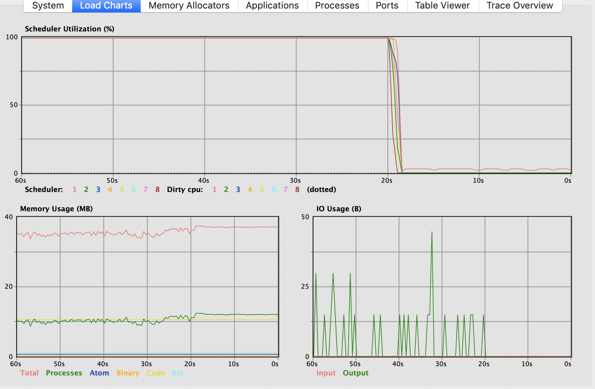

# Vampcounter

## Group Members

Abhishek Jaimini - 73652858

Apoorva Agarwal - 92586592


## Steps to run

1. Unzip the folder
2. Go to root directory
3. Run "mix deps.get"
3. Run command "time mix run --no-halt proj1.exs 100000 200000". (Time will work in case of mac and not for windows.)

## Workers

1. We have ceated 8 workers(Consumers) to utilize 8 cores present on machine. We have One Producer to handle the demands. One Producer-Consumer to print the results and One supervisor to supervise them all.
2. In each iteration, supervisor gives maximum range of 1000 to each worker. When a worker finishes up its range, supervisor allots it the next available range of 1000 numbers.
3. Our Workers (Consumers) do the computation and pass the result to common ProducerConsumer which prints the result.
4. We have used GenStage for the purpose of rataining state of demand for each worker.

## Result of given problem

```
Abhisheks-MacBook-Pro:vampcounter abhishekjaimini$ time mix run --no-halt proj1.exs 100000 200000
Compiling 1 file (.ex)
105210 501 210
105264 516 204
104260 401 260
102510 201 510
105750 150 705
108135 135 801
110758 158 701
115672 152 761
117067 167 701
116725 161 725
120600 201 600
118440 141 840
125500 251 500
123354 231 534
126000 210 600
126027 201 627
125248 152 824
124483 281 443
125433 231 543
125460 246 510 204 615
126846 261 486
129640 140 926
129775 179 725
131242 311 422
133245 315 423
132430 323 410
136525 635 215
134725 317 425
135828 588 231
135837 351 387
139500 150 930
136948 146 938
140350 401 350
143500 410 350
146137 461 317
145314 414 351
146952 156 942
150300 501 300
153000 510 300
152608 251 608
152685 585 261
153436 356 431
156240 651 240
156289 581 269
156915 165 951
162976 176 926
163944 396 414
173250 750 231
172822 782 221
174370 470 371
175329 759 231
180225 801 225
180297 897 201
182650 281 650
182700 870 210
182250 810 225
186624 864 216
190260 906 210
192150 915 210
193257 327 591
193945 395 491
197725 719 275

real	1m29.592s
user	8m20.287s
sys	  0m40.429s
```
## Time Analysis

1. CPU time = user + sys = 540.2 seconds
2. Real time = 90 seconds
3. CPU/Real time ratio = 6 cores

## Biggest Numbers calculated

1. In our project we were successfully able to run numbers till 1000000

## Utilization Chart



## Installation

If [available in Hex](https://hex.pm/docs/publish), the package can be installed
by adding `vampcounter` to your list of dependencies in `mix.exs`:

```elixir
def deps do
  [
    {:vampcounter, "~> 0.1.0"}
  ]
end
```

Documentation can be generated with [ExDoc](https://github.com/elixir-lang/ex_doc)
and published on [HexDocs](https://hexdocs.pm). Once published, the docs can
be found at [https://hexdocs.pm/vampcounter](https://hexdocs.pm/vampcounter).

